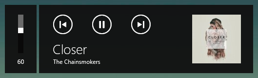
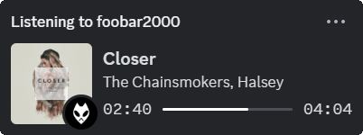

# foo_mediacontrol
Adds the ability for foobar2000 to interact with the Windows 10 media control overlay.

### Screenshots

Screenshot of the Windows 10 Media Control overlay



Screenshot of foobar2000 in your Discord status using
[**Music Presence**](https://github.com/ungive/discord-music-presence)



### Compilation
#### Windows

Compilation requires Windows 10 SDK version 10.0.10240.0 or higher.
 - Open the provided solution file (foobar2000/foo_mediacontrol/foo_mediacontrol.sln) in Visual Studio.
 - Change the target to "Release" and platform to "x86".
 - Build the solution (Default: Ctrl+Shift+B).
 - Move the resulting foo_mediacontrol.dll to your foobar2000's components folder.
 - (Re)Start foobar2000.

### Packaging
#### Windows

Build the project by opening Visual Studio and following these steps:

- Go to "Build" and click "Clean Solution"
- Select "Release" and "x86". Go to "Build" and click "Rebuild foo_mediacontrol"
- Select "Release" and "x64". Go to "Build" and click "Rebuild foo_mediacontrol"
- Wait until both builds completed successfully

Now open a command prompt and enter the following command,
presuming you have `make` installed:

```
make package
```

`fb2k-component` files for x86 and x64 will be in the `package` directory.

### License
----
[BSD-2-Clause](./LICENSE)